# Class Activity 1 — System Calls in Practice

- **Student Name:** Sao Dali Inaco
- **Student ID:** p20240003
- **Date:** 19/03/2025

---

## Warm-Up: Hello System Call

Screenshot of running `hello_syscall.c` on Linux:

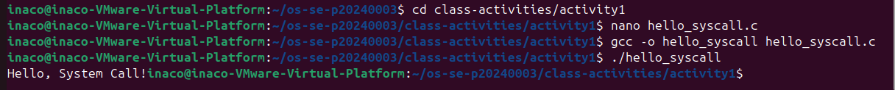

Screenshot of running `hello_winapi.c` on Windows (CMD/PowerShell/VS Code):

Screenshot of running `copyfilesyscall.c` on Linux:

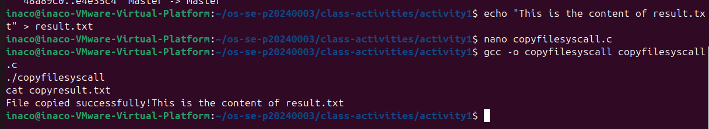

---

## Task 1: File Creator & Reader

### Part A — File Creator

**Describe your implementation:** [What differences did you notice between the library version and the system call version?]
> The library version is easier and more readable because it uses high-level functions like `fopen()`. The system call version uses low-level functions like `open()` and `write()`, which give more control but are more complex.

**Version A — Library Functions (`file_creator_lib.c`):**

<!-- Screenshot: gcc -o file_creator_lib file_creator_lib.c && ./file_creator_lib && cat output.txt -->
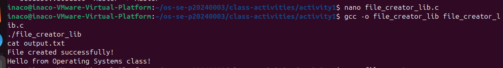

**Version B — POSIX System Calls (`file_creator_sys.c`):**

<!-- Screenshot: gcc -o file_creator_sys file_creator_sys.c && ./file_creator_sys && cat output.txt -->
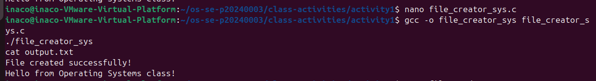

**Questions:**

1. **What flags did you pass to `open()`? What does each flag mean?**

   > O_CREAT | O_WRONLY | O_TRUNC

2. **What is `0644`? What does each digit represent?**

   > 0644 is a file permission in octal format.

3. **What does `fopen("output.txt", "w")` do internally that you had to do manually?**

	Calls open() with flags like O_CREAT | O_WRONLY | O_TRUNC

	Sets file permissions (e.g., 0644)

	Returns a file stream (FILE *)

	Handles buffering automatically

	Manages low-level system calls like write( >Manages low-level system calls like write() for you

### Part B — File Reader & Display

**Describe your implementation:** [Your notes]
>The library version is easier and more readable because it uses high-level functions like `fopen()`. The system call version uses low-level functions like `open()` and `write()`, which give more control but are more complex.

**Version A — Library Functions (`file_reader_lib.c`):**

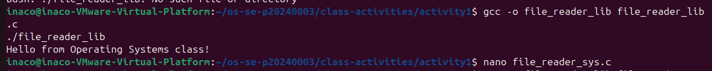

**Version B — POSIX System Calls (`file_reader_sys.c`):**

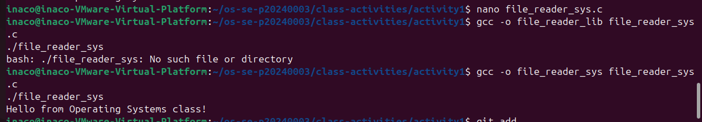

**Questions:**

1. **What does `read()` return? How is this different from `fgets()`?**

   > read() returns the number of bytes read (0 = EOF, -1 = error).
   >fgets() reads a line and returns a string, stopping at newline.

2. **Why do you need a loop when using `read()`? When does it stop?**

   > A loop is needed because read() reads in chunks.
   >It stops when read() returns 0 (EOF).

---

## Task 2: Directory Listing & File Info

**Describe your implementation:** [Your notes]

>The library version is simpler and uses functions like `opendir()` and `readdir()` to list files easily. The system call version is more complex and uses lower-level operations to read directory entries manually. Both produce similar outputs, but the library version is easier to write and understand, while the system call version provides more control.

### Version A — Library Functions (`dir_list_lib.c`)

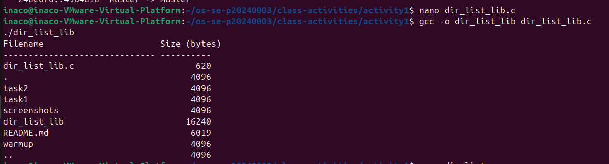

### Version B — System Calls (`dir_list_sys.c`)

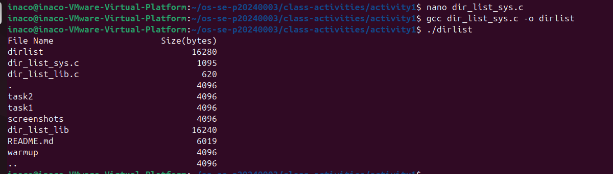

### Questions

1. **What struct does `readdir()` return? What fields does it contain?**

   > It returns a pointer to a struct dirent.It contains fields like the file name (d_name) and inode number (d_ino).

2. **What information does `stat()` provide beyond file size?**

   > It provides extra info like file type, permissions, owner, and timestamps (creation, access, modification).

3. **Why can't you `write()` a number directly — why do you need `snprintf()` first?**

   > Because only works with bytes (strings), not numbers.So snprintf() is needed to convert numbers into text before writing.

---

## Optional Bonus: Windows API (`file_creator_win.c`)

Screenshot of running on Windows:

### Bonus Questions

1. **Why does Windows use `HANDLE` instead of integer file descriptors?**

   > [Your answer]

2. **What is the Windows equivalent of POSIX `fork()`? Why is it different?**

   > [Your answer]

3. **Can you use POSIX calls on Windows?**

   > [Your answer]

---

## Task 3: strace Analysis

**Describe what you observed:** [What surprised you about the strace output? How many more system calls did the library version make?]

### strace Output — Library Version (File Creator)

<!-- Screenshot: strace -e trace=openat,read,write,close ./file_creator_lib -->
<!-- IMPORTANT: Highlight/annotate the key system calls in your screenshot -->
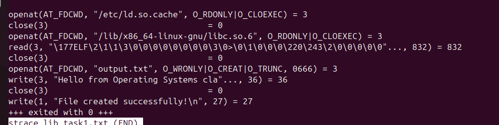

### strace Output — System Call Version (File Creator)

<!-- Screenshot: strace -e trace=openat,read,write,close ./file_creator_sys -->
<!-- IMPORTANT: Highlight/annotate the key system calls in your screenshot -->
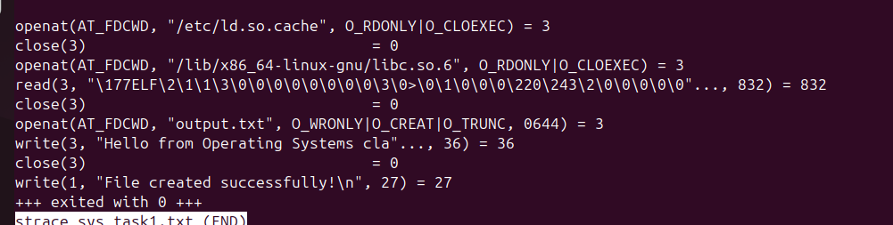

### strace Output — Library Version (File Reader or Dir Listing)

### strace Output — System Call Version (File Reader or Dir Listing)

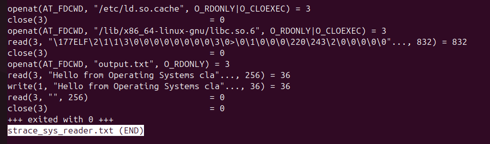

### strace -c Summary Comparison

<!-- Screenshot of `strace -c` output for both versions -->
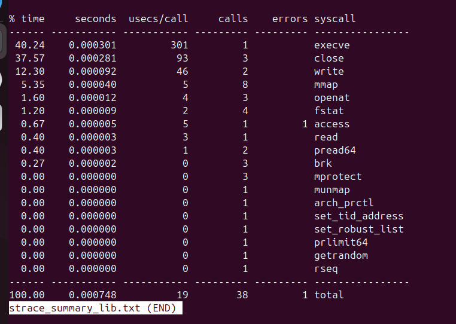
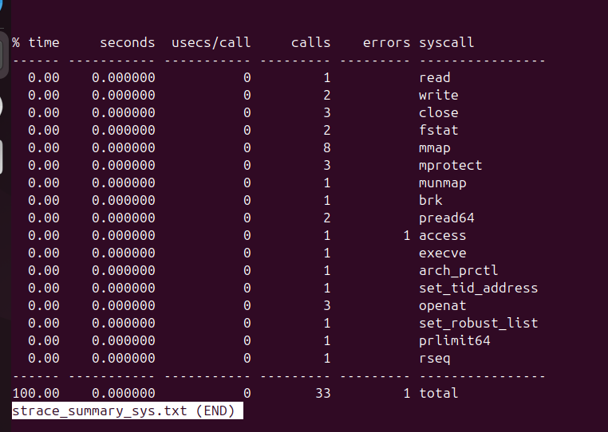

### Questions

1. **How many system calls does the library version make compared to the system call version?**

   > Library version: 38 calls
   > System call version: 33 calls
   

2. **What extra system calls appear in the library version? What do they do?**

   > Extra calls include: brk, mmap, munmap, mprotect, fstat
   > Memory allocation (brk, mmap)
   > Memory management (munmap, mprotect)
   > Getting file info (fstat)

3. **How many `write()` calls does `fprintf()` actually produce?**

   > 2 write() calls

4. **In your own words, what is the real difference between a library function and a system call?**

   > Library functions are higher-level and easier to use, but they internally call multiple system calls.
   > System calls are low-level operations that directly interact with the OS and give more control.

---

## Task 4: Exploring OS Structure

### System Information

> 📸 Screenshot of `uname -a`, `/proc/cpuinfo`, `/proc/meminfo`, `/proc/version`, `/proc/uptime`:

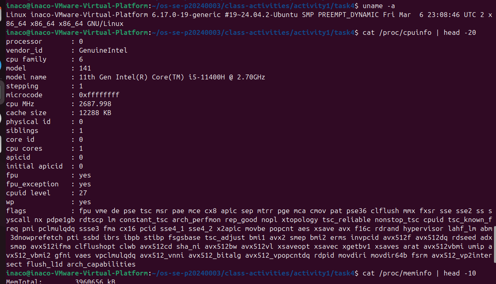

### Process Information

> 📸 Screenshot of `/proc/self/status`, `/proc/self/maps`, `ps aux`:

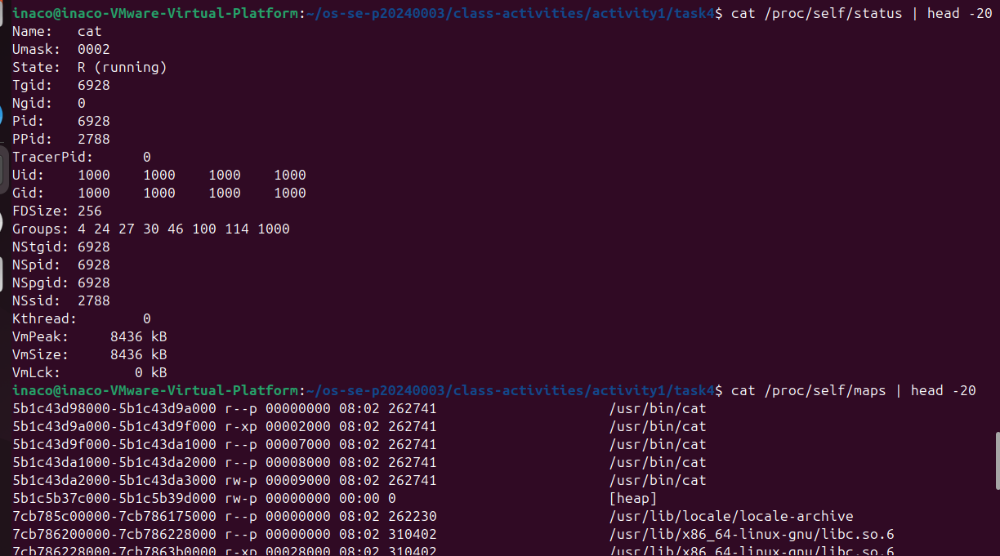

### Kernel Modules

> 📸 Screenshot of `lsmod` and `modinfo`:

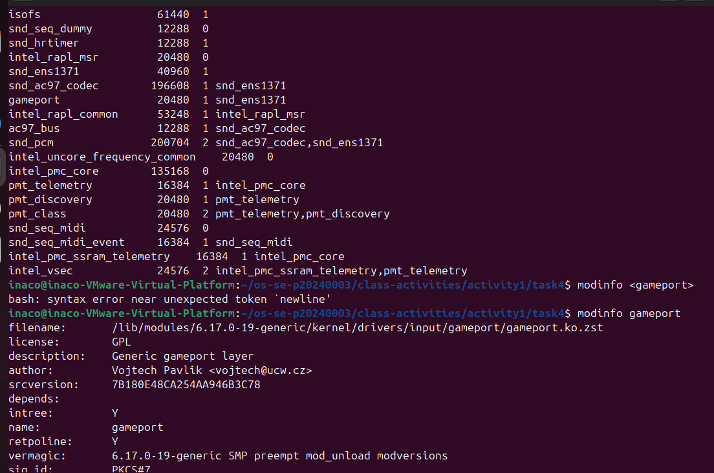

### OS Layers Diagram

> 📸 Your diagram of the OS layers, labeled with real data from your system:

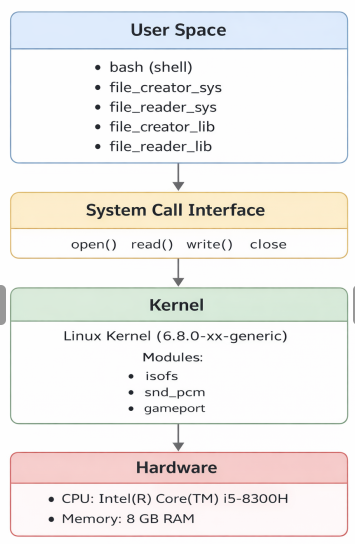

### Questions

1. **What is `/proc`? Is it a real filesystem on disk?**

   > /proc is a virtual filesystem that shows system and process information. It is not a real filesystem on disk; it is created by the kernel in memory.

2. **Monolithic kernel vs. microkernel — which type does Linux use?**

   > Linux uses a monolithic kernel (with modular support like isofs, snd_pcm, gameport shown in your output).

3. **What memory regions do you see in `/proc/self/maps`?**

   > Program (/usr/bin/cat)
   > [heap]
   > Shared libraries 
   > Memory mappings for execution and data

4. **Break down the kernel version string from `uname -a`.**

   > Kernel: Linux 6.17.0-19-generic
   > OS: Ubuntu
   > Architecture: x86_64
   > Build info: date, SMP, PREEMPT_DYNAMIC

5. **How does `/proc` show that the OS is an intermediary between programs and hardware?**

   > /proc exposes hardware and system info (CPU, memory, processes) through files. This shows that programs don’t access hardware directly—they go through the OS (kernel), which provides this information.

---

## Reflection

What did you learn from this activity? What was the most surprising difference between library functions and system calls?

> I learned how library functions and system calls work differently and how they interact with the operating system. The most surprising part was seeing through strace that library functions actually make multiple system calls behind the scenes, which makes them easier to use but less direct. I also learned how the /proc system provides real-time system and process information.
