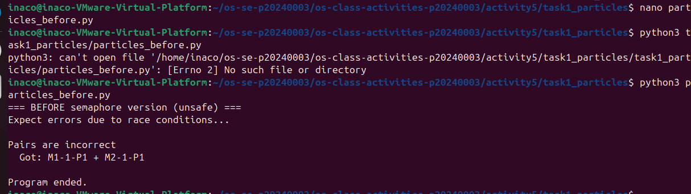
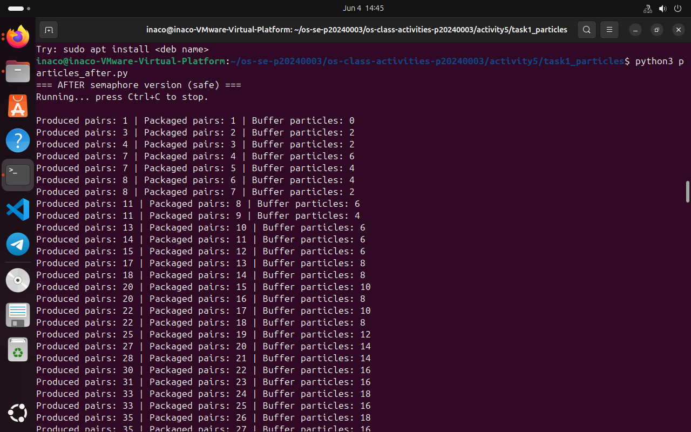
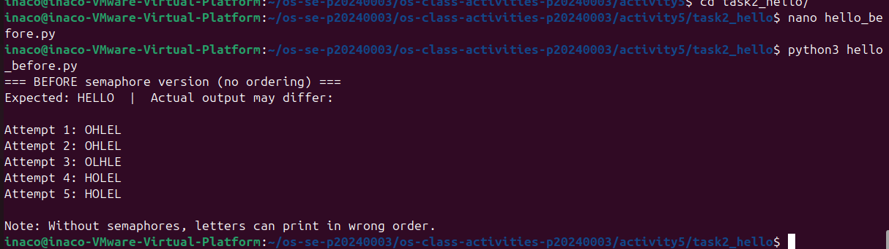
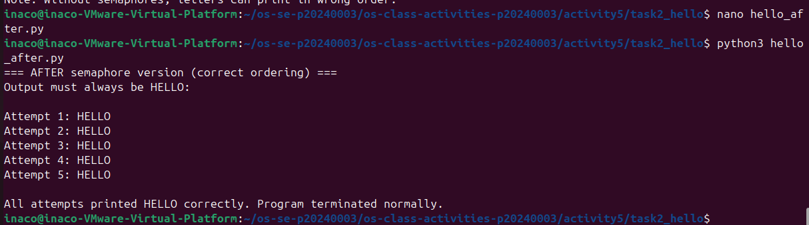

# Class Activity 5 - Semaphores

- **Student Name:** Sao Dali Inaco
- **Student ID:** p20240003
- **Programming Language Used:** Python 

---

## Task 1A: Particle Pair Buffer Before Semaphores

- What error or incorrect behavior appeared:
- Why did this happen without semaphore protection:

---

## Task 1B: Particle Pair Buffer After Semaphores

- Number of producer machines:
- Buffer capacity:
- Semaphores used:
- Produced pair count shown in screenshot:
- Packaged pair count shown in screenshot:
- Did any error appear during normal operation?

---

## Task 2A: HELLO Before Semaphores

- Output before semaphore ordering:
- Why this output can be wrong or unpredictable:

---

## Task 2B: HELLO After Semaphores

- Processes or threads used:
- Semaphores used:
- Final output:

---

## Questions

1. In Task 1, why does a producer need to wait before adding a pair to the buffer?
2. In Task 1, why does the consumer need to wait before removing a pair from the buffer?
3. Which semaphore protects the critical section in your particle buffer program?
4. How does your program verify that `P1` and `P2` belong to the same pair?
5. In Task 2, why can the program print letters in the wrong order without semaphores?
6. Which semaphore or synchronization step forces `H` to print before `E`, `L`, `L`, and `O`?
7. What could cause deadlock in either of your simulations?

---

## Reflection

_What did these simulations teach you about using semaphores for shared resources and ordered execution?_
