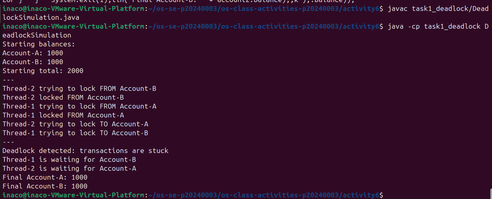
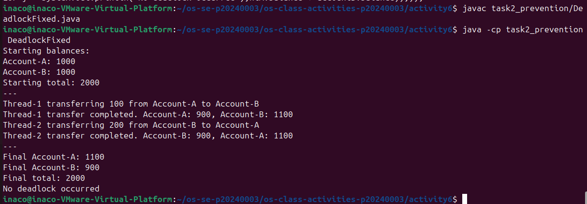

# Class Activity 6 - Deadlock Simulation

- **Student Name:** Sao Dali Inaco
- **Student ID:** p20240003
- **Programming Language Used:** java

---

## Task 1: Deadlock Version

- Shared resources:
- Transaction 1:
- Transaction 2:
- Deadlock message shown:
- Explanation of why the program got stuck:

---

## Task 2: Deadlock Prevention Version

- Prevention strategy used:
- Semaphore mutex initial value:
- Starting total:
- Final total:
- Did both transfers complete?
- Why no deadlock occurred:

---

## Questions

1. What are the two shared resources in your bank transaction simulation?
2. Which line or section of your Task 1 program creates hold-and-wait?
3. How does Task 1 create circular wait?
4. Why does the Task 1 program need a watchdog or timeout?
5. How does the single semaphore mutex prevent deadlock in Task 2?
6. Which of the four deadlock conditions does your Task 2 solution remove or avoid?
7. Why must the final total bank balance remain unchanged after both transfers?

---

## Reflection

_What did this activity teach you about deadlock prevention in real systems such as banking, databases, or file systems?_
